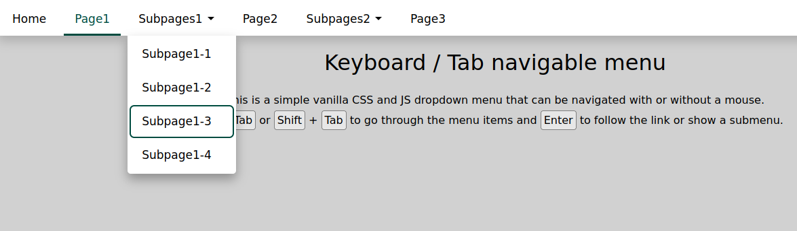

# HTML Keyboard / Tab navigable menu
This is a simple vanilla CSS and JS dropdown menu that can be navigated with or without a mouse.

Use <kbd>Tab</kbd> or <kbd>Shift</kbd> + <kbd>Tab</kbd> to go through the menu items and <kbd>Enter</kbd> to follow the link or show a submenu.

**[View the demo on CodePen →](https://codepen.io/ein-christoph/pen/ExwEXMv)**

# License

The code is available under the [The Unlicense](https://github.com/ein-christoph/keyboard-dropdown-menu/blob/main/LICENSE).
